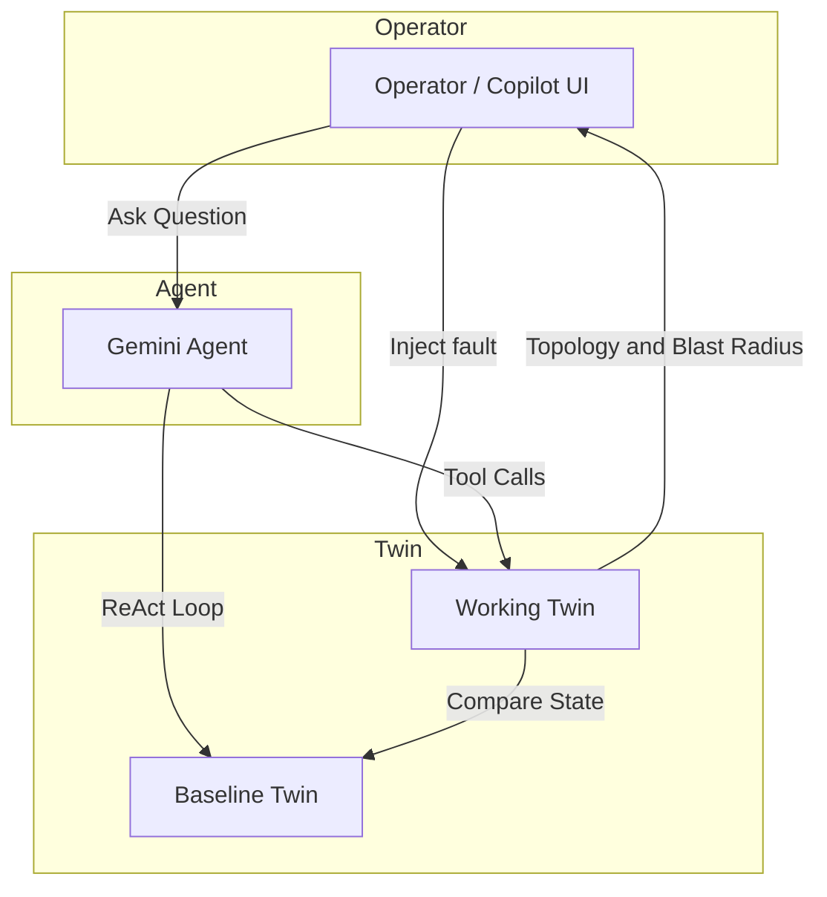

# Graphite

**An AI-powered network operations copilot built on a live digital twin.**

Graphite models a multi-site enterprise network as a digital twin, lets you inject
realistic faults, and uses an LLM agent to investigate impact the way a senior network
engineer would — grounding every conclusion in tool-verified facts, never guesses.



---

## What it does

- **Digital twin of the network** — 4 sites, ~40 devices (routers, core/distribution/
  access switches, firewalls, spine/leaf, servers, APs), links, VLANs, BGP, services, and
  user populations, built into a single graph.
- **Fault simulation** — disable devices/links, remove VLANs, degrade link latency, drop
  BGP peers; cascading effects propagate automatically against a mutable *working twin*
  while an immutable *baseline twin* is preserved for comparison.
- **Blast-radius analysis** — deterministic impact computation: affected devices,
  services, and users, with a severity rating and the factors behind it.
- **AI copilot** — a custom ReAct agent (no framework) plans, calls read-only tools,
  observes results, and produces a structured conclusion (summary, root cause, affected
  components, severity, confidence, remediation) — streamed live over SSE.

---

## Core capabilities

| Capability | Detail |
|---|---|
| Topology reasoning | Site/global topology, paths, reachability, inter-site connectivity |
| Impact analysis | Blast radius, service dependencies, single points of failure, failover |
| Simulation | 13 mutation operations with cascade + service-health recompute |
| Agent tooling | 34 tools total — 21 read-only exposed to the agent, 13 mutation API-only |
| Streaming UX | Thoughts → tool calls → observations → final answer, rendered live |

---

## Architecture

**Backend (Python · FastAPI · NetworkX)**

```
network_state/*.json  →  TwinBuilder  →  GraphWrapper (only NetworkX importer)
                                            ├─ AnalysisEngine   (query-only)
                                            └─ SimulationEngine (mutations + cascade)
                                                      │
                          ToolRegistry (21 query + 13 mutation)
                                                      │
                          ReAct Agent  ──►  LLM Provider (Gemini | Mock)
                                                      │
                          FastAPI:  /topology  /analysis  /simulation  /agent (SSE)
```

- **Two-twin model** — baseline (immutable) + working (mutable clone); reset restores state.
- **Query/mutation split** — the agent can *observe* but never *mutate*; mutations are
  API-only (simulation endpoints).
- **Grounded answers** — every factual claim must come from a tool observation.

**Frontend (Next.js · React 19 · @xyflow/react · Tailwind · Zustand)**

A topology-first operator console: an interactive network graph at the center, a persistent
AI copilot on the right, and fast fault-simulation controls on the left. Blast radius is
rendered as an additive overlay on the live topology.

---

## Demo scenarios

| # | Inject | Investigate |
|---|---|---|
| 1 | Remove **VLAN 420** (Bangalore) | Corp WiFi outage — 5,000 users, severity **critical** |
| 2 | Disable **`sg-leaf-03`** (Singapore) | DB cluster down → ERP/auth/wiki degraded, severity **critical** |
| 3 | **BLR–SG** WAN latency → 500ms | ERP slowness from Bangalore; degraded inter-site path |

Each scenario is a one-click button in the UI (deterministic), and can also be posed to the
copilot in natural language for a full AI investigation.

---

## Running it

**Prerequisites:** Python 3.11+ and Node 18+ (Node 22 recommended).

### 1. Backend

```bash
cd backend
python -m venv .venv && . .venv/bin/activate
pip install -r requirements.txt

cp .env.example .env          # add your GEMINI_API_KEY to enable the agent
python -m graphite.api        # serves http://localhost:8000
```

Run the tests:

```bash
cd backend && python -m pytest        # 94 passed
```

### 2. Frontend

```bash
cd frontend
npm install
# frontend/.env.local → NEXT_PUBLIC_API_BASE=http://localhost:8000
npm run dev                    # http://localhost:3000
```

Open **http://localhost:3000**, click a demo scenario (left rail) to inject a fault and see
the blast radius light up, then ask the copilot to investigate.

> The agent requires a `GEMINI_API_KEY`. Without one, the topology, simulation, blast-radius,
> and demo flows all work fully; only the live AI investigations are disabled.

---

## Repository layout

```
backend/        FastAPI app, twin/analysis/simulation engines, ReAct agent, tools, tests
frontend/       Next.js operator console (src/app, src/components, src/lib)
specs/          ADRs, schemas, frontend spec, demo scenarios
project_state/  Implementation status, context, build log, architecture deviations
```
