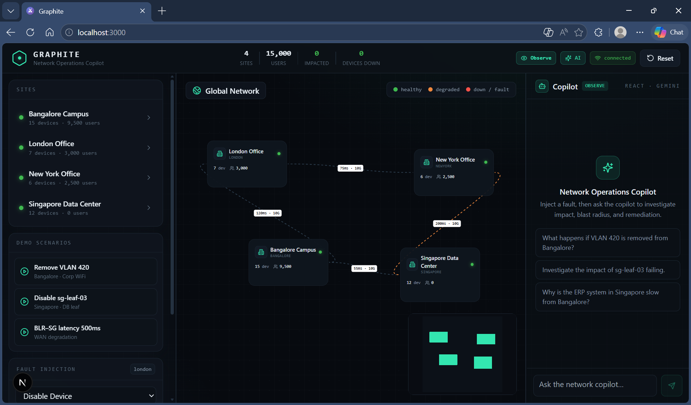
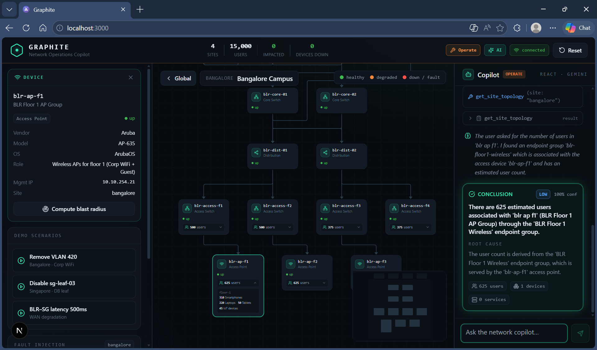
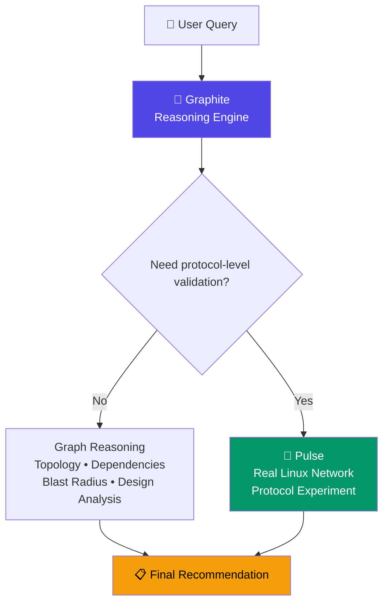

# Graphite

**An AI-powered network operations copilot for multi-site enterprise digital twins.**

[](#)
[](#)
[](#)
[](#)

Graphite models a multi-site enterprise network as a live digital twin. It lets you inject realistic faults, analyze blast radius, and ask a ReAct AI agent to investigate like a senior network engineer — grounding every conclusion in tool-verified facts, not guesses.

## Quick start

```bash
# 1. Install dependencies (Python venv + npm)
make install

# 2. Copy environment templates (optional, but add GEMINI_API_KEY for AI)
make env

# 3. Start the backend digital twin (Terminal 1)
make lab

# 4. Start the operator console (Terminal 2)
make ui
```

Then open **http://localhost:3000**. Click a demo scenario to inject a fault and watch the blast radius light up, or ask the copilot a natural-language question.

> **Note:** The agent requires a `GEMINI_API_KEY`. Without one, the topology, simulation, blast-radius, and demo flows all work; only live AI investigations are disabled.

## What Graphite does

- **Digital twin** — 4 sites, ~40 devices, links, VLANs, BGP, services, and user populations built into a single graph.
- **Fault simulation** — disable devices/links, remove VLANs, degrade latency, drop BGP peers; cascading effects propagate automatically against a mutable *working twin* while an immutable *baseline twin* is preserved for comparison.
- **Blast-radius analysis** — deterministic impact computation: affected devices, services, users, and severity.
- **AI copilot** — a custom ReAct agent plans read-only tool calls, observes results, and produces a structured conclusion streamed live over SSE.

## Screenshots

### Full enterprise topology



### Single site example



## Available make commands

| Command | Description |
|---|---|
| `make install` | Create the backend virtual environment, install Python dependencies, and run `npm install` in the frontend |
| `make env` | Copy `backend/.env.example` to `backend/.env` and create `frontend/.env.local` |
| `make lab` | Start the backend (FastAPI + MCP) on **http://localhost:8000** |
| `make ui` | Start the frontend (Next.js) on **http://localhost:3000** |
| `make test` | Run the backend pytest suite |
| `make clean` | Remove the backend venv and frontend `node_modules`/`.next` |

## Architecture

**Backend (Python · FastAPI · NetworkX)**

```text
network_state/*.json  →  TwinBuilder  →  GraphWrapper
                                       ├─ AnalysisEngine   (query-only)
                                       └─ SimulationEngine (mutations + cascade)
                                             │
                        ToolRegistry (21 query + 13 mutation + 2 meta)
                                             │
                              ReAct Agent  →  LLM Provider (Gemini | Mock)
                                             │
                                   FastAPI: /topology /analysis /simulation /agent
```

- **Two-twin model** — baseline twin is immutable; working twin is a mutable clone; `reset` restores state.
- **Query/mutation split** — the agent can observe but never mutate; mutations are API-only.
- **Grounded answers** — every factual claim is backed by a tool observation.

**Frontend (Next.js · React 19 · @xyflow/react · Tailwind · Zustand)**

A topology-first operator console: an interactive network graph at the center, a persistent AI copilot on the right, and fast fault-simulation controls on the left. Blast radius is rendered as an additive overlay on the live topology.

## Pulse

Pulse is a sibling project to Graphite. While Graphite answers **"What does the network look like?"** through topology, blast-radius, and dependency analysis, Pulse answers **"What is happening inside the network right now?"** by running real Linux networking stacks, routing protocols, and packet flows in a Mininet/FRR simulation. They are complementary: Graphite reasons over structure; Pulse validates runtime behavior.

### Future vision

When a query can be answered from the digital twin alone, Graphite reasons directly to a recommendation. When it needs protocol-level validation, Pulse builds a focused lab, runs the experiment, and feeds the observations back into Graphite for the final answer.



## Example scenarios

### 1. Maintenance planning

Ask the copilot:

> "I need to patch `sg-edge-01` tonight. Analyze whether this maintenance is safe."

The agent uses `compare_with_baseline`, `get_redundancy_status`, `get_blast_radius`, and `get_failover_path` to tell you whether the maintenance is safe, what would break, and how to recover.

### 2. Unexpected outage

Ask the copilot:

> "London users report they cannot access ERP. Determine the most likely root cause, identify the affected users and services, and recommend the fastest recovery plan."

The agent traces service dependencies, computes blast radius, and returns a root cause plus recovery steps.

## More scenarios to try

| Scenario | Prompt |
|---|---|
| Maintenance planning | "I need to perform maintenance on `sg leaf 03`. What do you suggest?" |
| Architecture review | "Perform a resilience assessment of the entire enterprise network. Identify the biggest architectural weaknesses, rank the single points of failure, and recommend the highest ROI improvements." |
| Executive risk review | "Black Friday starts tomorrow. Identify the three greatest risks to business continuity, estimate the operational impact, and recommend the minimum infrastructure changes needed before the event." |
| What-if | "What happens if both `blr core sw` die?" |

## Repository layout

```text
backend/        FastAPI app, twin/analysis/simulation engines, ReAct agent, tools, tests
frontend/       Next.js operator console (src/app, src/components, src/lib)
specs/          ADRs, schemas, frontend spec, demo scenarios
project_state/  Implementation status, context, build log, architecture deviations
```
