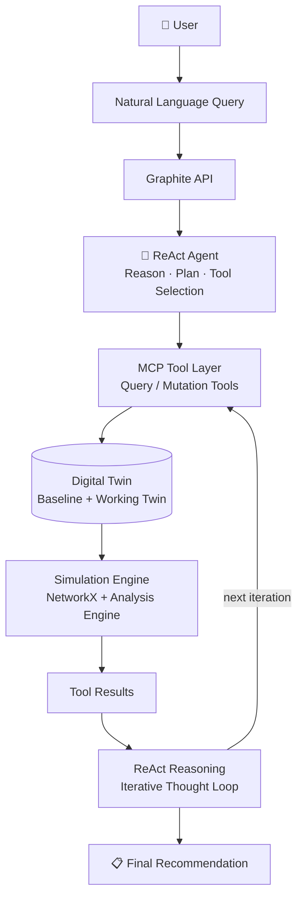
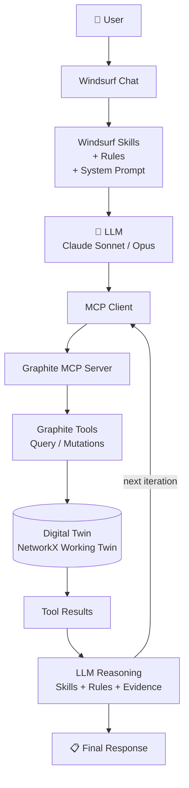

# Graphite Backend

Deterministic digital-twin backend for **Graphite — Intelligent Network Copilot**.

Graphite models an enterprise network as a single heterogeneous graph and answers
topology, fault-simulation, blast-radius, reachability, and troubleshooting questions.
The deterministic engine computes all network facts; the LLM agent only orchestrates
read-only tool calls and explains results.

## Architecture (see `../specs/`)

```
network_state/*.json
   -> TwinBuilder        (twin/builder.py)        JSON -> NetworkX MultiDiGraph
   -> GraphWrapper       (twin/graph_wrapper.py)  typed accessors (sole NetworkX user)
   -> TwinManager        (twin/manager.py)        immutable baseline + mutable working twin
        |-> AnalysisEngine   (analysis/)  pure queries  (read working/baseline)
        |-> SimulationEngine (simulation/) mutations + cascading effects (write working)
              -> ToolRegistry (tools/)    21 query + 13 mutation tools
                    -> ReactAgent (agent/)  ReAct loop, Gemini/Mock providers
                          -> FastAPI (api/)  REST + agent SSE
```

Key invariants:
- The baseline twin is **never** mutated; mutations target a `deepcopy` working twin.
- `GraphWrapper` is the only module importing `networkx`.
- BGP peering is stored as the `bgp_state` node attribute, never as graph edges.
- Service health is recomputed after every mutation.
- Removed VLANs remain as nodes with `status="removed"`.

## Interaction flows

Graphite can be driven through two different interaction models. Both feed the same deterministic digital twin and tools; they differ mainly in how the user submits the query and how the LLM/agent orchestration happens.

### 1. Programmatic / API flow

The user or another service sends a natural-language query to the FastAPI backend. The in-process ReAct agent interprets the query, plans read-only tool calls, runs them against the working twin, and iterates until it reaches a grounded final recommendation.



### 2. Windsurf / MCP-native flow

The user works inside an MCP-compatible IDE such as Windsurf. The chat message is enriched by Windsurf skills, rules, and a system prompt, then sent to an LLM (e.g., Claude Sonnet/Opus). The LLM acts as an MCP client, invokes tools exposed by the Graphite MCP server, observes the results, and returns a final response.



## Setup

```bash
cd backend
python -m venv .venv
source .venv/bin/activate          # Windows: .venv\Scripts\activate
pip install -r requirements.txt
cp .env.example .env               # then set GEMINI_API_KEY
```

## Build the twin (quick check)

```bash
python -c "from graphite.twin import TwinBuilder, TwinManager; \
m = TwinManager(TwinBuilder('network_state')); m.initialize(); m.clone_working(); \
print('nodes', m.baseline.number_of_nodes(), 'edges', m.baseline.number_of_edges())"
```

## Run the API

```bash
python -m graphite.api          # serves on GRAPHITE_API_HOST:GRAPHITE_API_PORT (0.0.0.0:8000)
# OpenAPI docs at /docs
```

Key endpoints:
- `GET /health` — status, version, `llm_configured`, site/device counts.
- `GET /topology/sites`, `/topology/sites/{site}`, `/topology/sites/{site}/summary`,
  `/topology/inter-site?site_a=&site_b=`, `/topology/devices/{id}`, `/topology/search`.
- `GET /analysis/blast-radius/{component_id}`, `/analysis/trace?source=&destination=`,
  `/analysis/reachability`, `/analysis/spof/{site}`, `/analysis/redundancy/{id}`,
  `/analysis/service-dependencies/{id}`.
- `POST /simulation/mutate` `{mutation_type, parameters}`, `POST /simulation/reset`,
  `GET /simulation/mutations`, `GET /simulation/diff`.
- `POST /agent/query` `{query, stream}` — Server-Sent Events when `stream=true`
  (thought / tool_call / tool_result / final_answer / error), else a JSON trace.
  Requires `GEMINI_API_KEY`; returns 503 otherwise.

## Tests

```bash
pytest            # from backend/  -> 94 passed
```

## Status

Run 1 delivered the deterministic backend (twin, graph, analysis, simulation, 34 tools).
Run 2 delivers the AI copilot: ReAct agent, Gemini/Mock LLM providers, and the FastAPI
layer (REST + agent SSE). Frontend is scheduled for a later run. See `../specs/project_state/`
for live status.
